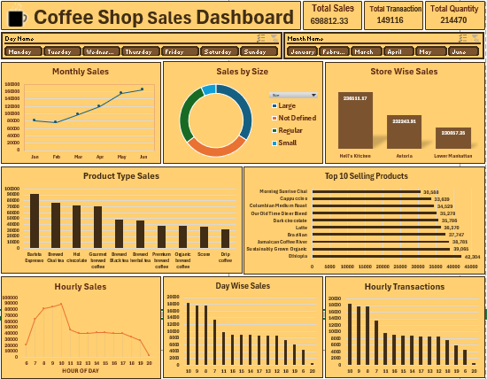

# ☕ Coffee Shop Sales Dashboard

An interactive **Microsoft Excel** dashboard built to analyze coffee shop sales performance using **Pivot Tables, Pivot Charts, Slicers, and dynamic KPI cards**. This project helps identify sales trends, product performance, store-wise comparisons, and customer purchasing patterns through an interactive and user-friendly dashboard.

---

## 📊 Dashboard Preview



---

## 📌 Key Metrics

* **Total Sales:** ₹6,98,812
* **Total Transactions:** 149,116
* **Total Quantity Sold:** 214,470

---

## 🛠️ Tools & Technologies

* Microsoft Excel
* Pivot Tables
* Pivot Charts
* Slicers
* GETPIVOTDATA
* Conditional Formatting
* Data Cleaning
* Dashboard Design

---

## 💼 Skills Demonstrated

* Data Cleaning
* Data Analysis
* Dashboard Development
* Data Visualization
* KPI Reporting
* Business Intelligence
* Interactive Dashboard Design

---

## ✨ Dashboard Features

* Interactive **Day-wise** and **Month-wise** filtering using slicers.
* Dynamic KPI cards that automatically update based on selected filters.
* Monthly sales trend analysis.
* Store-wise sales comparison.
* Product category performance analysis.
* Top 10 best-selling products.
* Hourly sales distribution.
* Transaction pattern analysis.
* Clean, professional, and presentation-ready dashboard layout.

---

## 📈 Business Insights

* Coffee products generated the highest overall sales.
* Morning hours recorded the highest customer activity.
* Sales performance varies across store locations.
* A small group of top-selling products contributes a significant share of total revenue.
* Monthly sales trends help identify seasonal demand patterns.
* Interactive filters enable quick comparison across different months and days.

---

## 📂 Dataset

**Dataset:** Coffee Shop Sales Dataset

The dataset contains transactional sales records, including:

* Transaction Date
* Transaction Time
* Store Location
* Product Category
* Product Type
* Quantity Sold
* Unit Price
* Total Sales

---

## 📁 Repository Structure

```text
Coffee-Shop-Sales-Dashboard/
│
├── Coffee Shop Dashboard.xlsx
├── Coffee Shop Sales.csv
├── Coffee-sales-Dashboard.png
└── README.md
```

---

## 🚀 How to Use

1. Download or clone this repository.
2. Open **Coffee Shop Dashboard.xlsx** in Microsoft Excel.
3. Use the **Day** and **Month** slicers to interact with the dashboard.
4. Explore KPIs, charts, and business insights dynamically.

---

## 🎯 Project Objective

The objective of this project is to transform raw sales data into an interactive business dashboard that enables stakeholders to monitor sales performance, identify trends, compare store performance, and support data-driven decision-making using Microsoft Excel.

---

## 👨‍💻 Author

**Kundan**

If you found this project useful, consider giving it a ⭐ on GitHub.
